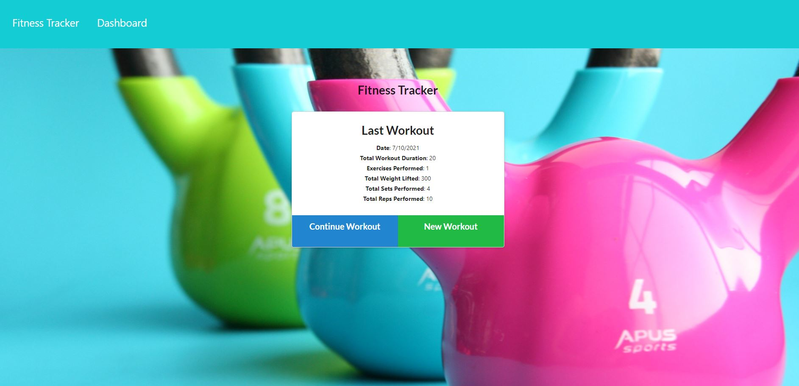
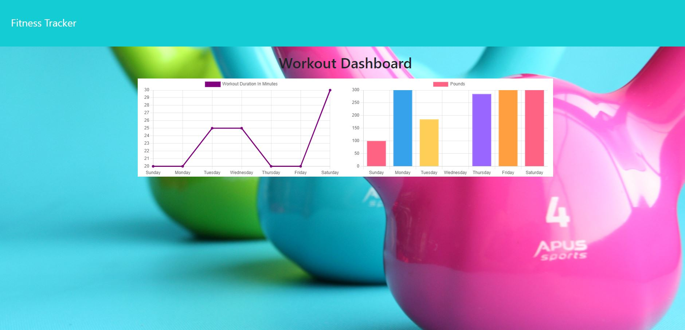

# Fitness Tracker

<!-- image credit: this image is from icons8-->

 ## Table of Contents
  - [Description / Objective](#description--objective)
  - [Links](#links)
  - [Screen Captures](#screen-captures)
  - [User Story](#user-story)
  - [Business Need](#business-need)
  - [Acceptance Criteria](#acceptance-criteria)
  - [Key Features](#key-features)
  - [Tools](#tools)
  - [Installation](#installation)
  - [Use](#use)
  - [License](#license)
  - [Contributors](#contributors)
  - [References](#references)
  - [Tests](#tests)
  - [Questions](#questions)

  ## Description / Objective
  This workout tracker demonstrates my ability to create a Mongo database with a Mongoose scheme and handle routes with Express. Front end code was provided and I customized is according to my preferences. 

  ## Links
  ### Github Repository 
  [Fitness Tracker on Github](https://github.com/NDaruwalla/fitness-tracker)

  ### Heroku Link 
  [Fitness Tracker on Heroku](https://limitless-meadow-87557.herokuapp.com/)

  ## Screen Captures

  ### Fitness Tracker Application Homepage
  
  Image of the Fitness Tracker application homepage showing details about the last workout. From here the user can create a new workout, continue a workout, or view the dashboard.

  

  ### Fitness Tracker Dashboard
  Image of the Fitness Tracker Dashboard showing graphs of total weight lifted by day and total duration of workout by day.

  


  ## User Story 
   ```md
    As a user, I want to be able to view create and track daily workouts. I want to be able to log multiple exercises in a workout on a given day. I should also be able to track the name, type, weight, sets, reps, and duration of exercise. If the exercise is a cardio exercise, I should be able to track my distance traveled.
  ```
  ## Business Need

    A consumer will reach their fitness goals more quickly when they track their workout progress.

  ## Acceptance Criteria
  ```md
  When the user loads the page, they should be given the option to create a new workout or continue with their last workout.

The user should be able to:

  * Add exercises to the most recent workout plan.

  * Add new exercises to a new workout plan.

  * View the combined weight of multiple exercises from the past seven workouts on the `stats` page.

  * View the total duration of each workout from the past seven workouts on the `stats` page.

  ```
  ## Key Features 
  The key features of this application include:

  * A visually pleasing UI
  * A dashboard with workout totals displayed in graphs
  * Forms to enter resistance training and/or strength training


  ## Tools
  The tools used to create this application include: HTML, CSS, JavaScript, Mongo DB, mongoose, Node, Dotenv, Express, Heroku, Github, Git Bash, and Visual Studio Code.

  ## Installation
  The following packages were installed:

    * Dotenv
    * Express
    * Mongoose
    * Morgan
    * Nodemon
    * Path


  ## Use
  Use this application is used to track workouts.

  ## License
  MIT
  
  [](https://opensource.org/licenses/MIT)  
  
  Click badge for license description.
  
  ## Contributors
  Nicole Daruwalla 

  ## References
  The following references were used to create this application: 
  - Assignment Readme
  - 


  ## Tests
  No tests are available at this time

  ## Questions
  If you have questions or need help with this application:

  Contact me on GitHub:
  [ndaruwalla](https://github.com/ndaruwalla)
 
  Or, via [Email](mailto:nicole.daruwalla@gmail.com)